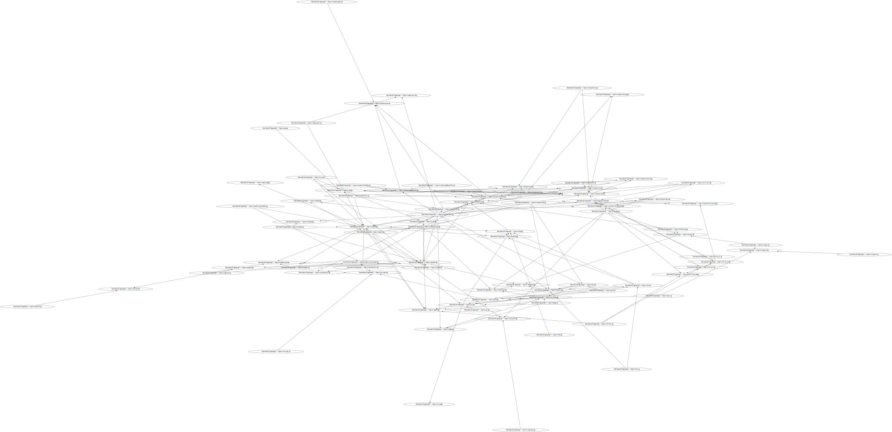

# Include Graph

## Usage

```shell
chmod +x Include-Graph/*.sh
cp Include-Graph/*.sh path/to/project/source
cd /path/to/project/source
./make-graph.sh
```

The result will be saved as `result.svg`. As a side effect, `result.dot` is also produced.

## Example output


